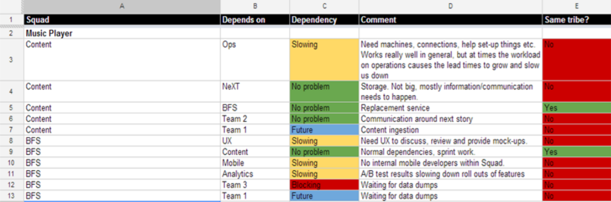

# Team Dependencies Tracking
Suggested tools and approaches to track team dependencies in an organization.
Based on some of the ideas in the book _Team Topologies_ by Matthew Skelton [@matthewskelton](https://github.com/matthewskelton) and Manuel Pais [@manupaisable](https://github.com/manupaisable).

> See [teamtopologies.com](https://teamtopologies.com/) for more details about Team Topolologies.

> Copyright © 2018-2020 [Team Topologies](https://teamtopologies.com/) - Licenced under [CC BY-SA 4.0](https://creativecommons.org/licenses/by-sa/4.0/) 

## Overview

All teams are part of a socio-technical system, and therefore will depend on other teams at some point in time, to a greater or lesser extent. Even if following the ideas in Team Topologies around increased or full ownership of end-to-end services, this is hardly ever 100% true.

That means we should be tracking dependencies between teams now and over time. Some dependencies might be fine today but in a few months from now they start slowing down the dependant team too much and we need to address it.

While ideally we might want to remove all dependencies, in practice we should identify which ones are problematic and should be removed, and which ones are "under control", for now at least. A problematic dependency introduces significant delays and/or are too unpredictability and/or increased work in progress (WIP) for the dependent team, slowing them down considerably.

## How to use

### Spotify dependency tracker

The article that described what became known as the "Spotify Model" (Oct 2012) also explained how Spotify tracked dependencies between teams over time with a simple spreadsheet. They would ask all their squads which other squads they depended on, and to what extent those dependencies were blocking or slowing them down. 

They would then address the the blocking and cross-tribe dependencies (namely through reorganization, architectural changes or technical
solutions), while continuing to monitor the remaining ones: 

 
[Source: <https://blog.crisp.se/wp-content/uploads/2012/11/SpotifyScaling.pdf> (page 6)]

Below is a table strongly inspired in the team dependencies tracker spreadsheet from Spotify:

| Team name/focus | Depends on Team | Type (blocking/slowing/ok) | Cross-streams (Yes/No) | Short description of dependency (artifacts, approvals, other) |  
| --------------- | ----------------| -------------------------- | ---------------------- | ------------------------------------------------------------- |
| .               |                 |                            |                        |                                                               |
| .               |                 |                            |                        |                                                               |
| .               |                 |                            |                        |                                                               |
| .               |                 |                            |                        |                                                               |
| .               |                 |                            |                        |                                                               |
| .               |                 |                            |                        |                                                               |
| .               |                 |                            |                        |                                                               |
| .               |                 |                            |                        |                                                               |
| .               |                 |                            |                        |                                                               |
| .               |                 |                            |                        |                                                               |

With a simple spreadsheet you can graph the evolution of the different dependencies over time and get early feedback on potential problems ahead.

## Other team dependency tools

* [Team dependency mapper by Troy Magennis](https://github.com/FocusedObjective/FocusedObjective.Resources) - an Excel Macro Spreadsheet that generates nice diagrams based on data you provide around team dependencies